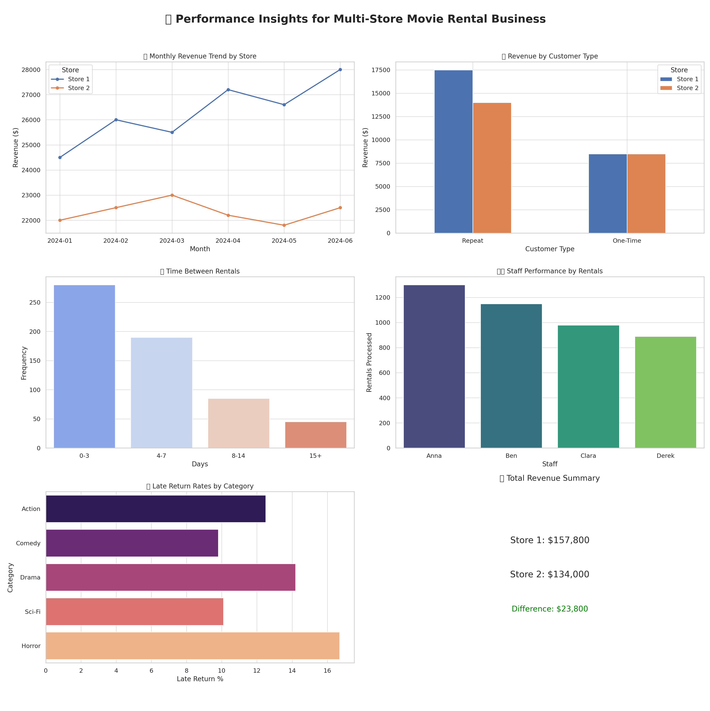

# Sakila-Store-Performance-Analysis
Analyzed Sakila’s rental database to identify why Store 2 underperforms compared to Store 1. Used SQL to uncover trends in revenue, customer behavior, staff efficiency, and inventory. Delivered actionable insights to boost retention, optimize stock, and improve store performance.

# Project Overview 
This project simulates a consulting engagement with Sakila, a global movie rental chain, where I was tasked with analyzing customer behavior, identifying revenue gaps, and recommending strategies to boost Store 2’s performance using advanced SQL, business logic, and visualization tools.

# Business Questions
| Business Question                                                     |  Value              |
| --------------------------------------------------------------------- | --------------------------------- |
| What drives the revenue difference between Store 1 and Store 2?       | Targeted performance benchmarking |
| Who are the high-value, but **inactive customers** at Store 2?        | Customer retention focus          |
| Which movie categories have **high demand but low inventory**?        | Inventory optimization            |
| Do **staff performance differences** impact rental revenue?           | HR-level business insight         |
| How does revenue vary by **rental duration, language, and category**? | Pricing & engagement strategy     |

 # SQL Insights 

Inactive high-value customers at Store 2
```sql
SELECT c.first_name, c.last_name, SUM(p.amount) AS total_spent, MAX(r.rental_date) AS last_rental
FROM customer c
JOIN payment p ON c.customer_id = p.customer_id
JOIN rental r ON c.customer_id = r.customer_id
WHERE c.store_id = 2
GROUP BY c.customer_id
HAVING DATEDIFF(CURDATE(), MAX(r.rental_date)) > 90
ORDER BY total_spent DESC
LIMIT 10;

```

Category-level performance comparison between Store 1 and Store 2
```sql

SELECT 
    c.name AS category,
    s.store_id,
    SUM(p.amount) AS revenue
FROM film_category fc
JOIN category c ON fc.category_id = c.category_id
JOIN film f ON fc.film_id = f.film_id
JOIN inventory i ON f.film_id = i.film_id
JOIN store s ON i.store_id = s.store_id
JOIN rental r ON i.inventory_id = r.inventory_id
JOIN payment p ON r.rental_id = p.rental_id
GROUP BY c.name, s.store_id
ORDER BY c.name, s.store_id;

```

Revenue Trend by Month per Store

```sql

SELECT s.store_id,
       DATE_FORMAT(p.payment_date, '%Y-%m') AS month,
       SUM(p.amount) AS monthly_revenue
FROM payment p
JOIN staff s ON p.staff_id = s.staff_id
GROUP BY s.store_id, month
ORDER BY s.store_id, month;
```

Most Popular Movie Categories by Rental Volume
```sql

SELECT c.name AS category, COUNT(r.rental_id) AS total_rentals
FROM rental r
JOIN inventory i ON r.inventory_id = i.inventory_id
JOIN film f ON i.film_id = f.film_id
JOIN film_category fc ON f.film_id = fc.film_id
JOIN category c ON fc.category_id = c.category_id
GROUP BY c.name
ORDER BY total_rentals DESC;
```

Average Rental Duration by Category
```sql
SELECT c.name AS category,
       ROUND(AVG(DATEDIFF(r.return_date, r.rental_date)), 2) AS avg_rental_days
FROM rental r
JOIN inventory i ON r.inventory_id = i.inventory_id
JOIN film f ON i.film_id = f.film_id
JOIN film_category fc ON f.film_id = fc.film_id
JOIN category c ON fc.category_id = c.category_id
WHERE r.return_date IS NOT NULL
GROUP BY c.name
ORDER BY avg_rental_days DESC;

```

 Customer Repeat Rate
 ```sql

SELECT COUNT(DISTINCT customer_id) AS total_customers,
       COUNT(customer_id) - COUNT(DISTINCT customer_id) AS repeat_customers,
       ROUND((COUNT(customer_id) - COUNT(DISTINCT customer_id)) * 100.0 / COUNT(customer_id), 2) AS repeat_rate_percent
FROM rental;

```

# Store Performance Insights




# Insights & Business Alignment

|  **Query Title**                                            |  **Insight**                                                              |  **How It Supports Objective**                                                                                                 |
| ------------------------------------------------------------- | --------------------------------------------------------------------------- | ---------------------------------------------------------------------------------------------------------------------------------------------------- |
| **Inactive High-Value Customers at Store 2**                  | Identifies customers who spent the most but haven't rented in over 90 days. |  Reveals revenue loss opportunities. These customers are prime targets for reactivation (e.g., email campaigns, loyalty offers).                   |
| **Category-Level Performance Comparison Between Store 1 & 2** | Shows revenue contribution of each category by store.                       |  Highlights categories that underperform in Store 2, guiding better inventory or promotion strategies.                                             |
| **Revenue Trend by Month per Store**                          | Displays how revenue fluctuates over time for both stores.                  |  Helps pinpoint when Store 2 began lagging, possibly aligning with staffing, stock, or seasonal factors.                                           |
| **Most Popular Movie Categories by Rental Volume**            | Ranks genres by total rentals across all stores.                            | Informs inventory planning. If Store 2 lacks top categories, it explains underperformance.                                                        |
| **Average Rental Duration by Category**                       | Shows how long different categories are typically rented for.               | Long rentals can tie up inventory. Adjusting rental duration policies at Store 2 can improve circulation and revenue.                             |
| **Customer Repeat Rate**                                      | Calculates how many customers rent more than once.                          |  A low repeat rate at Store 2 would indicate poor service or experience. Helps justify retention strategies (e.g., feedback surveys or discounts). |


